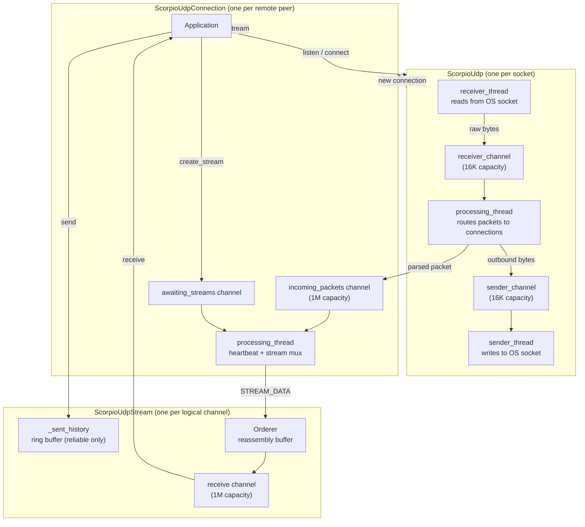
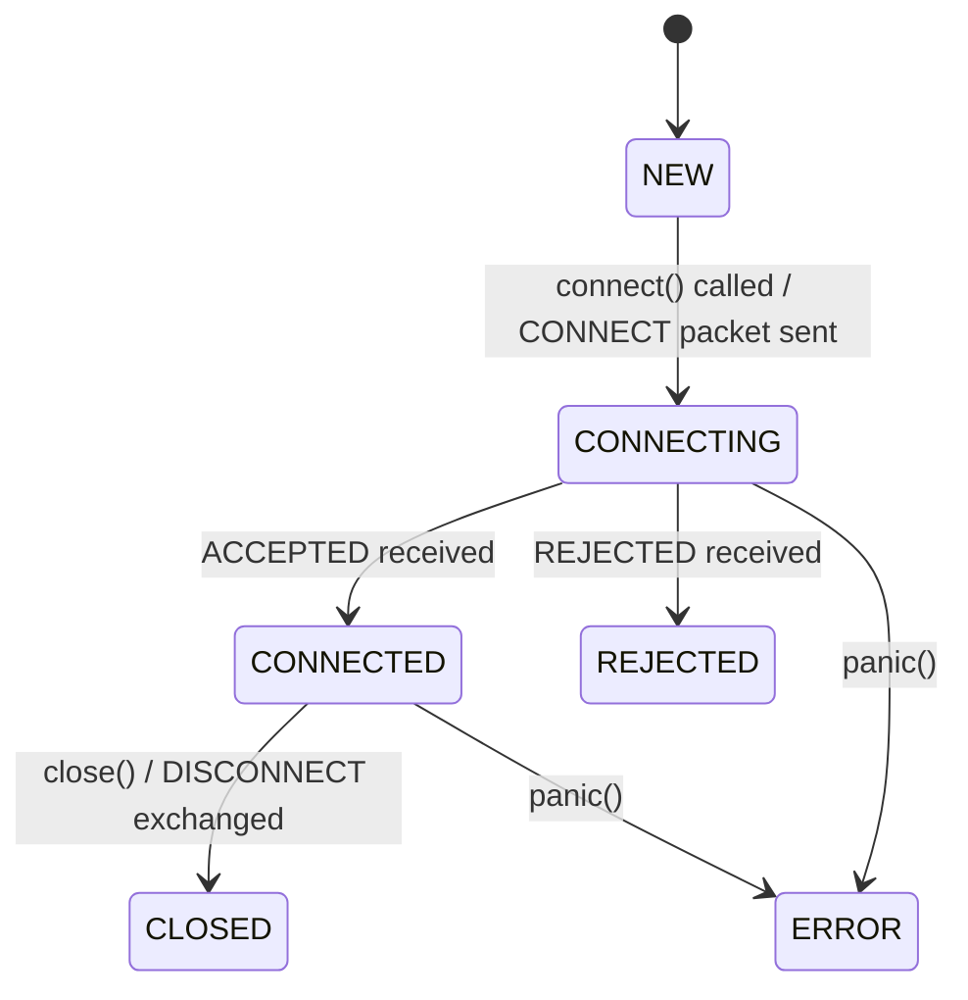
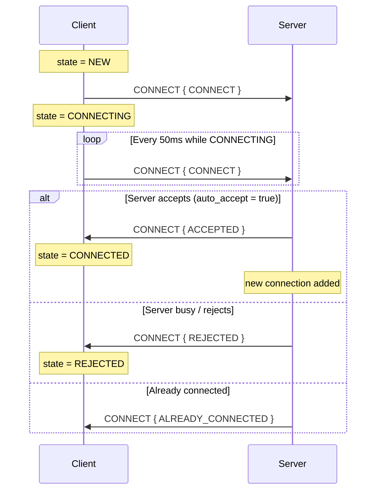
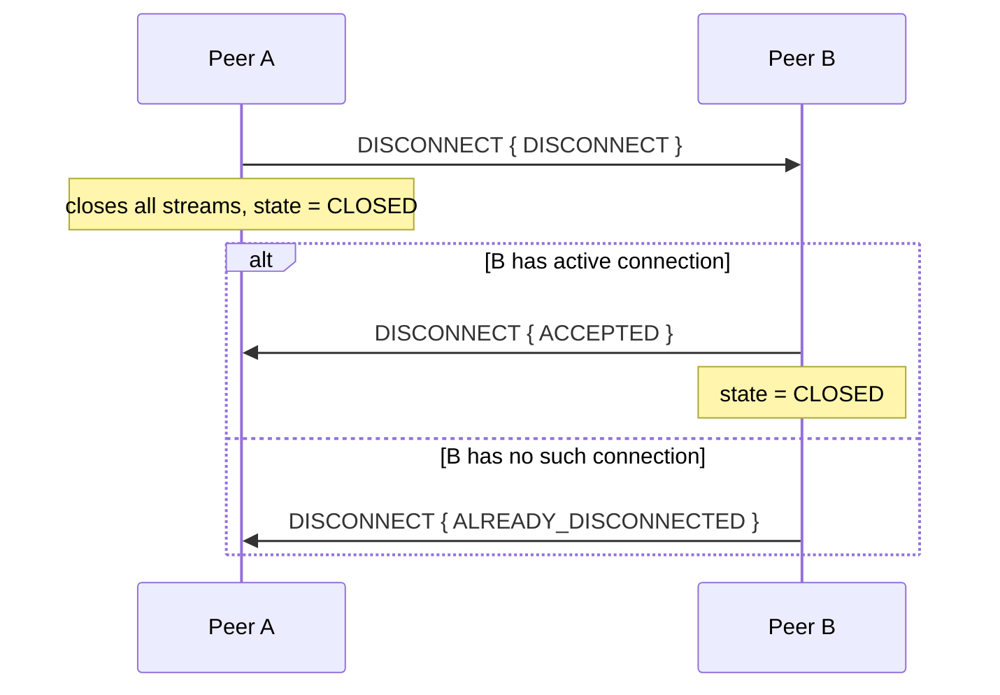
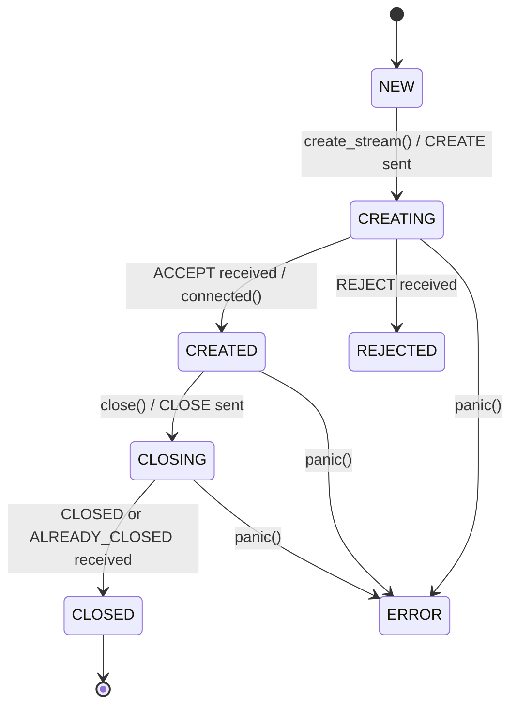
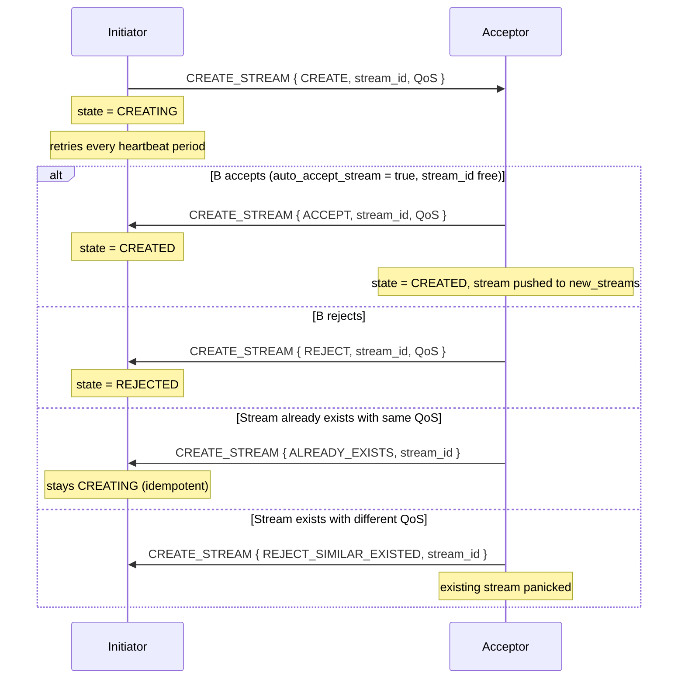
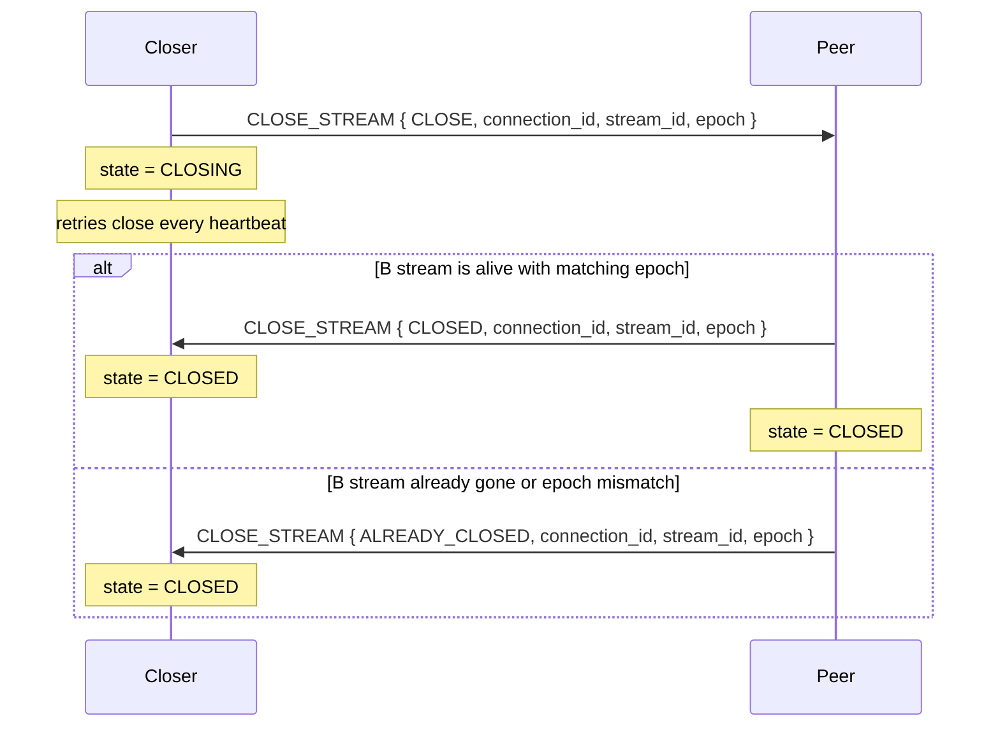

# ScorpioUdp Protocol

ScorpioUdp is a connection-oriented, multiplexed protocol built on top of raw UDP. It adds reliable and unreliable ordered streams, connection handshaking, heartbeat-driven keepalive, and selective retransmission - all within a 512-byte packet budget.

## Architecture



## Packet Format

Every packet starts with a single **command byte**, followed by optional header fields, and then the payload. All multi-byte integers are **big-endian** (network byte order).

### Command byte layout

```
 Bit:  7       6       5   4   3   2   1   0
       NOT_LAST FIRST  [reserved]  command (4 bits)
```

| Bits | Name | Meaning |
|------|------|---------|
| 3-0 | command | One of the 9 command codes |
| 6 | FIRST | Set on the first packet of a multi-packet message |
| 7 | NOT_LAST | Set on every packet except the last of a multi-packet message |

### Header fields (conditional)

After the command byte, header fields appear in this order when present:

| Field | Type | Present when |
|-------|------|--------------|
| StreamNumber | `uint16_t` | command is `STREAM_DATA` or `CLOSE_STREAM` |
| SeqNumber | `uint32_t` | command is `STREAM_DATA` or `CLOSE_STREAM` |
| FramesLeft | `uint16_t` | `NOT_LAST` flag is set (more packets follow) |
| StreamEpoch | `uint8_t` | command is `STREAM_DATA` on a **reliable** stream (right after FramesLeft if present, otherwise right after SeqNumber) |

`StreamEpoch` on `STREAM_DATA` is only present for reliable streams, and is written into **every** fragment of a multi-packet message (not just the first). Unreliable `STREAM_DATA` carries no epoch.

Everything after the header is payload (subcommand byte + data).

### Single-packet message (no fragmentation)

```
+----------+--------------+-----------+---------------------+----------+
| cmd byte | StreamNumber | SeqNumber | StreamEpoch (opt.)  | payload  |
| (1 byte) |  (2 bytes)   | (4 bytes) |      (1 byte)       | (N bytes)|
+----------+--------------+-----------+---------------------+----------+
  FIRST set, NOT_LAST clear, no FramesLeft
  StreamEpoch present only for reliable STREAM_DATA
```

### Multi-packet message (fragmented)

First packet:
```
+----------+--------------+-----------+------------+---------------------+------------------+
| cmd byte | StreamNumber | SeqNumber | FramesLeft | StreamEpoch (opt.)  |    payload       |
| (1 byte) |  (2 bytes)   | (4 bytes) | (2 bytes)  |      (1 byte)       | fills to 512 B   |
+----------+--------------+-----------+------------+---------------------+------------------+
  FIRST=1, NOT_LAST=1
  StreamEpoch present only for reliable STREAM_DATA
```

Middle packets:
```
+----------+--------------+-----------+------------+---------------------+------------------+
| cmd byte | StreamNumber | SeqNumber | FramesLeft | StreamEpoch (opt.)  |    payload       |
  FIRST=0, NOT_LAST=1, FramesLeft counts down
  StreamEpoch is written into every fragment, not just the first
```

Last packet:
```
+----------+--------------+-----------+---------------------+----------+
| cmd byte | StreamNumber | SeqNumber | StreamEpoch (opt.)  | payload  |
  FIRST=0, NOT_LAST=0, no FramesLeft
```

## Command Codes

| Value | Name | SeqNum | Stream | Connectionless | Description |
|-------|------|--------|--------|----------------|-------------|
| 0 | PING | - | - | yes | Connectivity probe |
| 1 | CONNECT | - | - | yes | Connection establishment |
| 2 | DISCONNECT | - | - | yes | Connection teardown |
| 3 | STATUS | - | - | - | Status query (reserved) |
| 4 | ERROR | - | - | - | Error notification (reserved) |
| 5 | HEARTBEAT | - | - | - | Keepalive + ACK carrier |
| 6 | CREATE_STREAM | - | - | - | Stream creation |
| 7 | CLOSE_STREAM | yes | yes | - | Stream closure |
| 8 | STREAM_DATA | yes | yes | - | Application data |

### Subcommands

Each command packet carries a 1-byte subcommand as the first payload byte. `CONNECT`, `DISCONNECT`, `CREATE_STREAM`, and `CLOSE_STREAM` packets additionally carry an 8-byte [connection id](#connection-identity) immediately after the subcommand byte (every subcommand of all four commands). `HEARTBEAT` also carries the connection id, right after the command byte (it has no subcommand). See the [Connection identity](#connection-identity), [Stream creation handshake](#stream-creation-handshake), [Stream closure](#stream-closure), and [HEARTBEAT packet payload](#heartbeat-packet-payload) sections for the exact layout of each.

**PING subcommands:**

| Value | Name | Direction |
|-------|------|-----------|
| 0 | PING | initiator -> peer |
| 1 | PONG | peer -> initiator |

> PING is only partially implemented; treat it as experimental.

**CONNECT subcommands:**

| Value | Name | Direction |
|-------|------|-----------|
| 0 | CONNECT | initiator -> acceptor |
| 1 | ACCEPTED | acceptor -> initiator |
| 2 | REJECTED | acceptor -> initiator |
| 3 | ALREADY_CONNECTED | acceptor -> initiator |

**DISCONNECT subcommands:**

| Value | Name | Direction |
|-------|------|-----------|
| 0 | DISCONNECT | either -> either |
| 1 | ACCEPTED | responder -> initiator |
| 2 | REJECTED | responder -> initiator |
| 3 | ALREADY_DISCONNECTED | responder -> initiator, or unsolicited (see below) |

`ALREADY_DISCONNECTED` is also sent **unsolicited** (rate limited to one per heartbeat
period per peer address) in reply to a HEARTBEAT arriving for an address the socket has
no connection for, echoing the heartbeat's connection id. A peer that receives
`ALREADY_DISCONNECTED` whose id matches its own live CONNECTED connection fails that
connection immediately ("the other side has no state for me - it must have restarted")
instead of waiting for the 5 s no-packet timeout. A mismatched id is ignored, so a stale
reply addressed to a previous incarnation can never tear down a fresh connection.

Both CONNECT and DISCONNECT packets lay out their payload as the subcommand byte followed by the 8-byte connection id:

```
+------+---------------+-----------------------------+
| cmd  | subcommand    | connection id               |
| 1 B  |   1 B         |   8 B (uint64, big-endian)  |
+------+---------------+-----------------------------+
```

The responder always echoes back the connection id it received, unchanged. See [Connection identity](#connection-identity).

**CREATE_STREAM subcommands:**

| Value | Name | Direction |
|-------|------|-----------|
| 0 | CREATE | initiator -> acceptor |
| 1 | ACCEPT | acceptor -> initiator |
| 2 | REJECT | acceptor -> initiator |
| 3 | REJECT_SIMILAR_EXISTED | acceptor -> initiator (same ID, different QoS) |
| 4 | ALREADY_EXISTS | acceptor -> initiator (same ID, same QoS **and same epoch**) |

Every `CREATE_STREAM` subcommand carries the same fixed prefix, followed by subcommand-specific fields:

```
+------+---------------+--------------+-------+-----...
| cmd  | subcommand    | connection id| Stream| Stream
| 1 B  |   1 B         |  8 B (u64)   |Number | Epoch  ...
+------+---------------+--------------+-------+-----...
                                        2 B     1 B
```

`StreamNumber` and `StreamEpoch` follow the connection id on **every** subcommand (`CREATE`, `ACCEPT`, `REJECT`, `REJECT_SIMILAR_EXISTED`, `ALREADY_EXISTS`). Only `CREATE` (and the `ACCEPT` echo) additionally append the QoS bytes after that (see [Stream creation handshake](#stream-creation-handshake) for the QoS layout). The connection id is validated against the local connection; a mismatch causes the packet to be **silently dropped** (no response), same as HEARTBEAT.

**CLOSE_STREAM subcommands:**

| Value | Name | Direction |
|-------|------|-----------|
| 0 | CLOSE | initiator -> acceptor |
| 1 | CLOSED | acceptor -> initiator |
| 2 | ALREADY_CLOSED | acceptor -> initiator |

Every `CLOSE_STREAM` packet, regardless of subcommand, has this fixed layout:

```
+------+------------+----------------+--------------+-------------+
| cmd  | subcommand | connection id  | StreamNumber | StreamEpoch |
| 1 B  |    1 B     |  8 B (u64)     |    2 B       |    1 B      |
+------+------------+----------------+--------------+-------------+
```

A connection id mismatch causes the packet to be **silently dropped** (no response). A stream number/epoch that doesn't match a live stream on the receiver is treated as already-closed (`ALREADY_CLOSED` response) rather than dropped.

## Connection Lifecycle

### State machine



### Connection handshake



### Disconnection



### Connection identity

Every connection carries a **connection id**: a `uint64_t` (`ConnectionId`) chosen at random by the initiator when `connect()` is called. It is sent in every CONNECT and DISCONNECT packet (all subcommands) and the acceptor stores and echoes it back unchanged.

The connection id is **not** a demultiplexing key - a connection is still identified solely by its remote `ip:port`, and there is at most one connection per peer address. The id exists only as a guard against a peer that dies and restarts so fast that the other side never noticed the old connection went stale.

How the id is used:

- **CONNECT for an existing connection.** If the stored id matches, the acceptor replies `ALREADY_CONNECTED`. If it differs (a restarted peer reusing the same address with a fresh id), the acceptor **soft-panics its own stale connection and sends nothing back**. The old connection drops to `ERROR` (no longer alive) and is evicted on the next lookup; the initiator keeps retrying CONNECT every heartbeat and gets accepted once the stale entry is gone.
- **ACCEPTED / REJECTED / ALREADY_CONNECTED responses.** Ignored if the id does not match the local connection (`ACCEPTED` with a mismatched id also draws an `ERROR` reply). This prevents a late reply meant for a previous incarnation from advancing the current connection's state.
- **DISCONNECT.** Accepted (replied `ACCEPTED`, connection closed) only when the id matches a live connection for that address; otherwise the responder replies `ALREADY_DISCONNECTED`. A late DISCONNECT response addressed to a previous incarnation is therefore ignored and cannot tear down a freshly re-established connection.
- **CREATE_STREAM / CLOSE_STREAM / HEARTBEAT.** All three also carry the connection id (see [Stream creation handshake](#stream-creation-handshake), [Stream closure](#stream-closure), [HEARTBEAT packet payload](#heartbeat-packet-payload)). Unlike CONNECT/DISCONNECT, a mismatch here is **not** answered at all - the whole packet is silently dropped, since it means the peer's view of the connection is already stale.

## Stream Lifecycle

### State machine



### Stream creation handshake

A CREATE_STREAM `CREATE` packet carries the connection id, stream number, stream epoch, and QoS inline after the subcommand byte (see [Subcommands](#subcommands) for the full per-subcommand layout):

```
+------+----------+---------------+--------------+-------------+-------------+------------------+
| cmd  | CREATE=0 | connection id | StreamNumber | StreamEpoch | reliability | depth (optional) |
| 1 B  |   1 B    |  8 B (u64)    |    2 B       |    1 B      |    1 B      |      2 B         |
+------+----------+---------------+--------------+-------------+-------------+------------------+
  depth only present when reliability > UNRELIABLE_LATEST_ONLY
```

`StreamEpoch` is a `uint8_t` chosen for the stream slot: initiators seed it randomly per stream number when the connection is created and increment it on every local `create_stream()` call; acceptors adopt whatever value the initiator sent in `CREATE`. A block/packet whose epoch doesn't match the receiver's live value for that stream number is treated as belonging to a stale, previous incarnation of the stream (see [HEARTBEAT packet payload](#heartbeat-packet-payload)).

How the acceptor resolves a `CREATE` against its local state for that stream number:

- **No live stream, slot free** -> accept (or `REJECT` when auto-accept is off / QoS unsupported).
- **No live stream, but the slot is still claimed** by a dead stream the application has not
  released yet (or by a local `create_stream()` awaiting activation) -> the packet is
  **dropped silently**. This is transient: the initiator retries `CREATE` every heartbeat
  and either succeeds once the slot frees or gives up after `SCU_UDP_CREATE_RETRY_PERIOD`.
  The receiver never blocks waiting for the slot.
- **Live stream, different QoS** -> the local stream is panicked, reply `REJECT_SIMILAR_EXISTED`.
- **Live stream, same QoS, same epoch** -> reply `ALREADY_EXISTS` (idempotent retry).
- **Live stream, same QoS, different epoch** -> a **new incarnation**:
  - if the local stream was created by the peer, the local copy is stale: it is panicked and
    the packet is dropped (the peer's retry succeeds once the slot frees);
  - if the local stream was created locally, both peers created the same stream number
    concurrently. The tie-break is deterministic: **the connection dialer's stream wins**.
    The acceptor-side peer panics its own stream and stays silent; the dialer-side peer
    ignores the packet. Both sides converge without any freeze or reply loop.



### Stream closure

Every CLOSE_STREAM packet carries `connection id`, `StreamNumber`, and `StreamEpoch` after the subcommand byte (see [Subcommands](#subcommands) for the exact layout).



## Stream QoS

| Mode | Value | Description | Ordering | Retransmit |
|------|-------|-------------|----------|------------|
| UNRELIABLE | 0 | Best-effort, no ordering | No | No |
| UNRELIABLE_LATEST_ONLY | 1 | Only newest kept | No | No |
| RELIABLE_UNORDERED | 2 | All delivered, any order | No | Yes |
| RELIABLE_ORDERED | 3 | All delivered, in order | Yes | Yes |

Only `UNRELIABLE` and `RELIABLE_ORDERED` are currently supported. The `depth` field in QoS specifies the retransmit history size for reliable streams (0 means 65536).

## Reliable Delivery

Reliable streams use a **NACK-based retransmission** mechanism piggybacked onto the periodic HEARTBEAT packet.

### How it works

1. **Sender** stores every sent packet in `_sent_history`, a ring buffer of size `depth + SCU_UDP_QOS_DEPTH_SAFETY_BUFFER`, together with its sequence number and last-transmit time.
2. **Receiver** buffers incoming packets in an `Orderer` and delivers them in order. It tracks which sequence number ranges it has received.
3. **Every heartbeat (50ms)**, the receiver encodes its held ranges into a HEARTBEAT packet.
4. **Sender** reads the HEARTBEAT, finds gaps between the reported ranges, and resends missing packets from `_sent_history`.
5. **Tail retransmission**: packets above everything the ranges mention (`[end_last, current seq)`) cannot be NACKed - the receiver does not know they exist. The sender proactively resends this unacked tail as well (front-first, bounded by `SCU_UDP_TAIL_RESEND_BUDGET` per heartbeat), so the lost last packets of a burst are still recovered.
6. **Retransmission throttle**: a packet is never retransmitted more often than once per `SCU_UDP_RESEND_INTERVAL` (measured from its last transmit). Without it, any packet in flight longer than one heartbeat period would be resent on every heartbeat, amplifying congestion into a retransmission storm.
7. **Range validation**: reported ranges must be ascending and can never exceed the sender's current sequence number. A block that violates this (corruption, or a stale incarnation echo) is ignored in its entirety rather than acted upon.

### HEARTBEAT packet payload

A single HEARTBEAT packet carries ACK/NACK state for one or more reliable streams. The command byte appears **once** and is immediately followed by the 8-byte [connection id](#connection-identity). Each reliable stream then contributes one block, packed back-to-back until the 512-byte packet is full.

```
+----------+---------------+     +--------------+-------+-------+------+-------+------+-------+------+----
|  cmd     | connection id |     | StreamNumber | epoch | count | end0 | beg1  | end1 | beg2  | end2 | ...
|  1 B     |     8 B        |     |    2 B       |  1 B  |  1 B  |  4 B |  4 B  |  4 B |  4 B  |  4 B |
+----------+---------------+     +--------------+-------+-------+------+-------+------+-------+------+----
                                 \___________________ repeated per reliable stream ___________________/
```

- `connection id` = the connection's `uint64_t` id. The receiver **drops the entire heartbeat** if it does not match the local connection (guards against a stale connection incarnation, same as CONNECT/CREATE_STREAM/...). Liveness (`last received packet time`) is refreshed only **after** this validation succeeds - a heartbeat from a mismatched incarnation must not keep a zombie connection alive.
- `epoch` = the stream's `StreamEpoch` (`uint8_t`). A block whose epoch does not match the live stream is treated as an **unknown stream**: the receiver replies `CLOSE_STREAM { ALREADY_CLOSED }` **echoing the epoch from the block** (so the reply matches the sender's live incarnation and actually closes it) and skips the block.
- `count` = number of gap ranges for this stream (`count + 1` ranges reported total)
- `end0` = next expected sequence number (one past the last contiguously received packet)
- Each following `(begin, end)` pair describes a held range that sits above a gap

The sender reads each stream block in turn and resends every sequence number in `[end_i, begin_{i+1})` that is still within its history window.

### Stuck-resend self-heal

If a requested sequence number has already fallen out of `_sent_history` (evicted by the ring buffer), the sender cannot honor the resend and just logs a warning - this can otherwise loop forever on a reliable-ordered stream. If the peer keeps requesting the **same** out-of-history sequence number continuously for the no-packet timeout (default `SCU_UDP_TIMEOUT`), the sender panics its own stream (forcing the peer to eventually rebuild it via a fresh CREATE_STREAM) instead of getting stuck retrying indefinitely.

### Sequence number wrapping

`SeqNumber` is `uint32_t` and wraps freely. A `_sequence_complement` counter (`uint32_t`) extends it to a monotonic `size_t` for history indexing and distance comparisons. Wrap detection uses the rule: if the delta exceeds half the `uint32_t` range, a wrap occurred.

## Fragmentation and Reassembly

Large messages are split automatically:

- A single-packet message carries no `FramesLeft` field (`FIRST` set, `NOT_LAST` clear)
- When fragmented, every packet except the last carries `FramesLeft` (counting down); the first fragment additionally sets the `FIRST` flag
- The last packet clears `NOT_LAST` and omits `FramesLeft`
- Usable payload is `512 - header_size`; fragmented packets lose a further 2 bytes to the `FramesLeft` field

On the receive side:
- **Reliable streams**: the `Orderer` reassembles fragments in sequence order before delivering
- **Unreliable streams**: fragments are held in `received_frames` keyed by sequence number; a complete message is assembled once all frames between a `FIRST` frame and the last frame are present. Incomplete sets expire after 500ms

## Keepalive and Timeout

- A HEARTBEAT is sent every **50ms** from each connection's processing thread.
- If no packet (of any kind) is received for the **no-packet timeout** (default **5 seconds**, `SCU_UDP_TIMEOUT`; overridable at build time via `#ifndef` and at runtime via `ScorpioUdp::set_no_packet_timeout`), the connection panics and closes. Only packets that passed **connection id validation** count as proof of life; traffic from a mismatched (stale) incarnation is dropped without refreshing the clock.
- The liveness clock is refreshed in two places: by the packet handlers on the connection's processing thread, and - for HEARTBEATs only - **at routing time** on the socket processing thread, after validating the connection id carried in the heartbeat. The routing-time refresh means a connection whose processing thread is behind on its incoming-packet queue cannot false-panic while valid heartbeats are still arriving.
- Each **reliable** stream additionally tracks its own last-heartbeat-ACK time independently of the connection: if the no-packet timeout elapses without a heartbeat response covering that stream, only that stream panics (`State::ERROR`) - the connection and its other streams are unaffected.
- A stream stuck in **CLOSING** for the no-packet timeout (the peer never answers the close) panics instead of retrying forever - a live CLOSING stream pins its stream number, which would otherwise stay unusable.
- When a **connection** dies (panic, rejection, or any abnormal processing-thread exit), the failure **cascades to every stream** on it, including streams still queued for creation. No stream may outlive its connection in a usable-looking state.
- The HEARTBEAT serves double duty: keepalive signal and reliable-stream ACK/NACK carrier.
- HEARTBEATs and all other control packets (CONNECT/DISCONNECT/CREATE_STREAM/CLOSE_STREAM/ERROR) travel through a **priority send queue** drained before bulk STREAM_DATA, so a saturated data path cannot starve keepalives into false timeouts.
- Control-plane sends issued from protocol threads (heartbeats, handshake replies, retransmissions, CREATE/CLOSE retries) are **non-blocking, drop-on-full**: when even the priority queue is full the packet is dropped and its natural retry cycle (the next heartbeat tick or the peer's retry) recovers it. Blocking would wedge the issuing protocol thread - which also drains incoming packets - turning TX backpressure into a false no-packet timeout. Only the application-facing `ScorpioUdpStream::send` (bulk STREAM_DATA) blocks; that is the intended backpressure point. Dropped heartbeats are counted per connection (`heartbeat_skip_count`).

## Protocol Constants

| Constant | Value | Meaning |
|----------|-------|---------|
| `SCU_UDP_MAX_PACKET_SIZE` | 512 bytes | Maximum UDP payload |
| `SCU_UDP_HEARTBEAT_PERIOD` | 50 ms | Heartbeat interval (overridable at build time via `#ifndef`) |
| `SCU_UDP_TIMEOUT` | 5 s | **Default** no-packet timeout before disconnect; also the CLOSING and stuck-resend give-up timeout. Overridable at build time (`#ifndef`) and at runtime (`ScorpioUdp::set_no_packet_timeout`) |
| `SCU_UDP_CREATE_RETRY_PERIOD` | 5 s | Stream creation give-up timeout (CREATE retried every heartbeat until this elapses) |
| `SCU_UDP_UNRELIABLE_DATA_EXPIRY_NS` | 500 ms | Expiry for incomplete unreliable fragments |
| `SCU_UDP_QOS_DEPTH_SAFETY_BUFFER` | 4096 | Extra history slots beyond QoS depth |
| `SCU_UDP_RESEND_INTERVAL` | 150 ms (3 heartbeats) | Minimum time between retransmissions of the same packet |
| `SCU_UDP_TAIL_RESEND_BUDGET` | 64 | Maximum tail retransmissions per heartbeat per stream |
