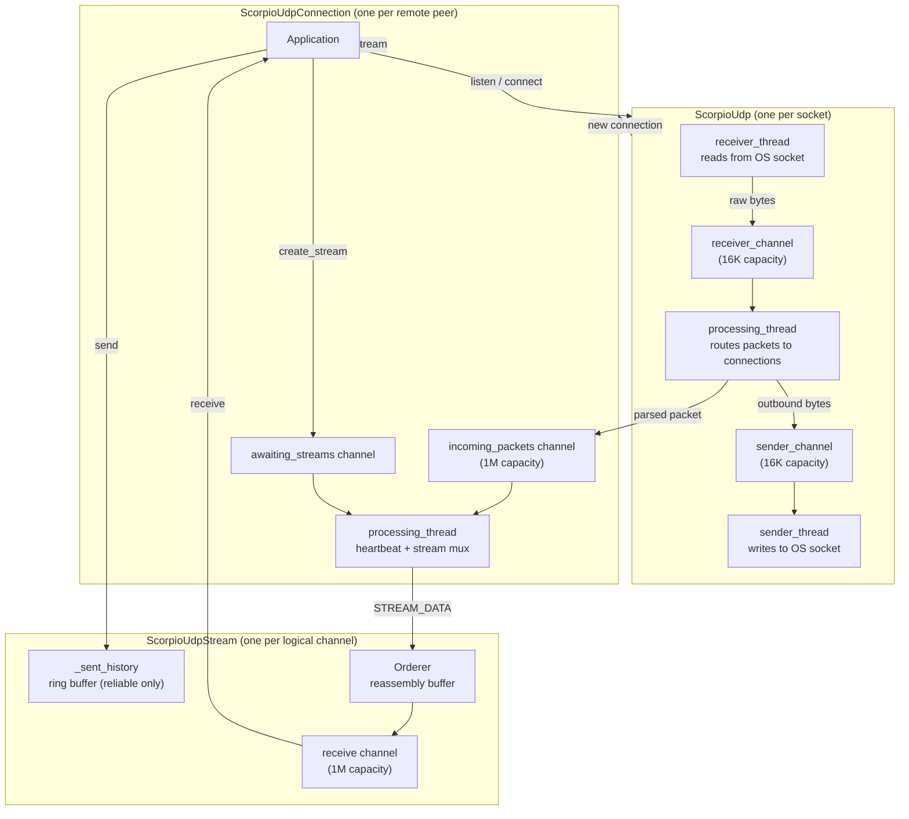
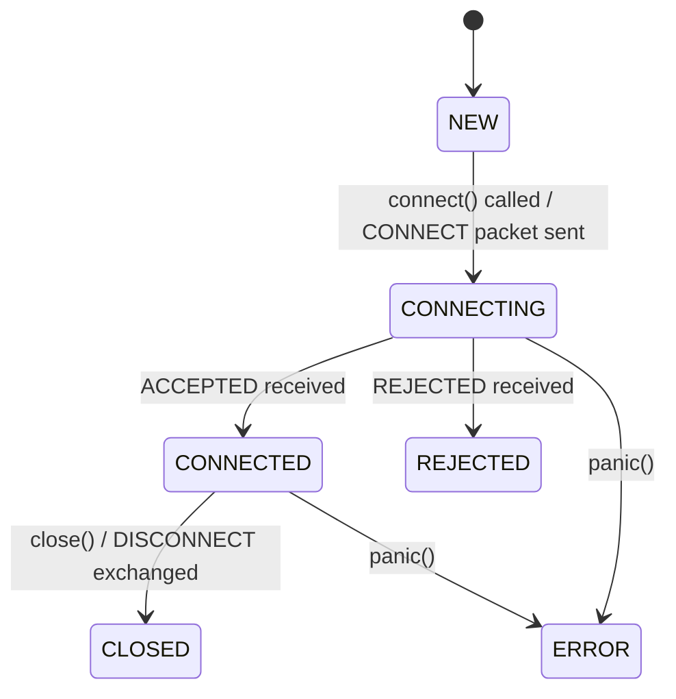
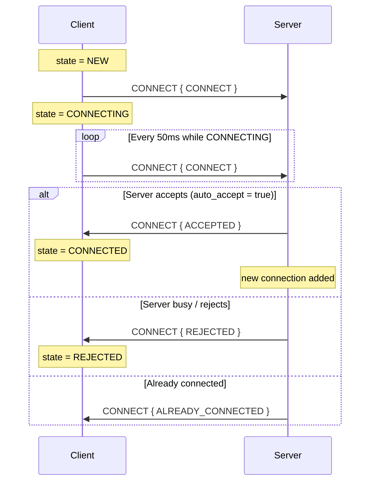
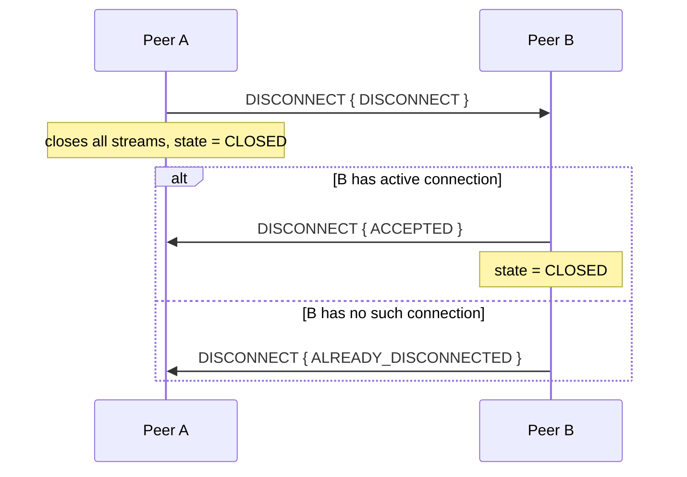
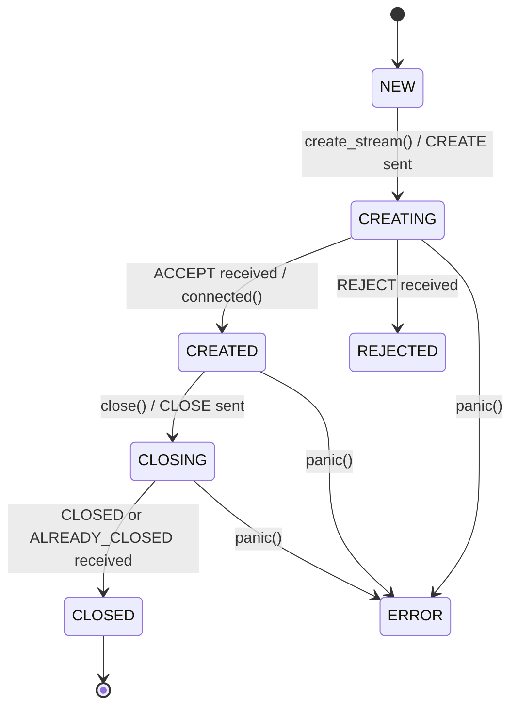
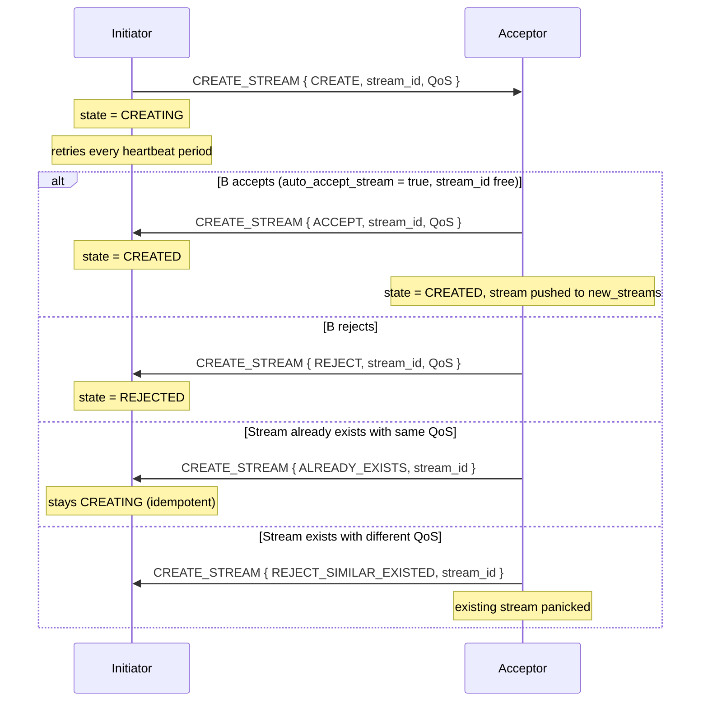
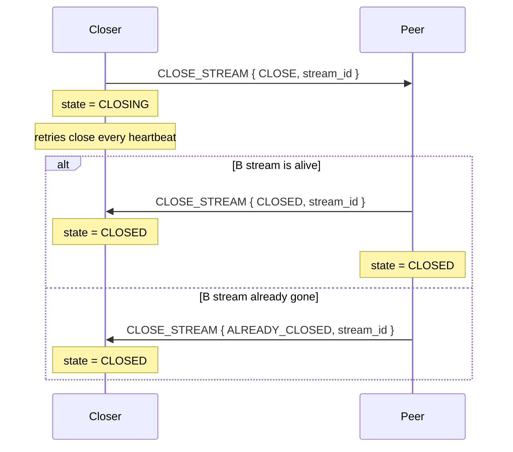

# ScorpioUdp Protocol

ScorpioUdp is a connection-oriented, multiplexed protocol built on top of raw UDP. It adds reliable and unreliable ordered streams, connection handshaking, heartbeat-driven keepalive, and selective retransmission - all within a 512-byte packet budget.

## Architecture



## Packet Format

Every packet starts with a single **command byte**, followed by optional header fields, and then the payload. All multi-byte integers are **big-endian** (network byte order).

### Command byte layout

```
 Bit:  7       6       5   4   3   2   1   0
       NOT_LAST FIRST  [reserved]  command (4 bits)
```

| Bits | Name | Meaning |
|------|------|---------|
| 3-0 | command | One of the 9 command codes |
| 6 | FIRST | Set on the first packet of a multi-packet message |
| 7 | NOT_LAST | Set on every packet except the last of a multi-packet message |

### Header fields (conditional)

After the command byte, header fields appear in this order when present:

| Field | Type | Present when |
|-------|------|--------------|
| StreamNumber | `uint16_t` | command is `STREAM_DATA` or `CLOSE_STREAM` |
| SeqNumber | `uint32_t` | command is `STREAM_DATA` or `CLOSE_STREAM` |
| FramesLeft | `uint16_t` | `NOT_LAST` flag is set (more packets follow) |

Everything after the header is payload (subcommand byte + data).

### Single-packet message (no fragmentation)

```
+----------+--------------+-----------+----------+
| cmd byte | StreamNumber | SeqNumber | payload  |
| (1 byte) |  (2 bytes)   | (4 bytes) | (N bytes)|
+----------+--------------+-----------+----------+
  FIRST set, NOT_LAST clear, no FramesLeft
```

### Multi-packet message (fragmented)

First packet:
```
+----------+--------------+-----------+------------+------------------+
| cmd byte | StreamNumber | SeqNumber | FramesLeft |    payload       |
| (1 byte) |  (2 bytes)   | (4 bytes) | (2 bytes)  | fills to 512 B   |
+----------+--------------+-----------+------------+------------------+
  FIRST=1, NOT_LAST=1
```

Middle packets:
```
+----------+--------------+-----------+------------+------------------+
| cmd byte | StreamNumber | SeqNumber | FramesLeft |    payload       |
  FIRST=0, NOT_LAST=1, FramesLeft counts down
```

Last packet:
```
+----------+--------------+-----------+----------+
| cmd byte | StreamNumber | SeqNumber | payload  |
  FIRST=0, NOT_LAST=0, no FramesLeft
```

## Command Codes

| Value | Name | SeqNum | Stream | Connectionless | Description |
|-------|------|--------|--------|----------------|-------------|
| 0 | PING | - | - | yes | Connectivity probe |
| 1 | CONNECT | - | - | yes | Connection establishment |
| 2 | DISCONNECT | - | - | yes | Connection teardown |
| 3 | STATUS | - | - | - | Status query (reserved) |
| 4 | ERROR | - | - | - | Error notification (reserved) |
| 5 | HEARTBEAT | - | - | - | Keepalive + ACK carrier |
| 6 | CREATE_STREAM | - | - | - | Stream creation |
| 7 | CLOSE_STREAM | yes | yes | - | Stream closure |
| 8 | STREAM_DATA | yes | yes | - | Application data |

### Subcommands

Each command packet carries a 1-byte subcommand as the first payload byte.

**CONNECT subcommands:**

| Value | Name | Direction |
|-------|------|-----------|
| 0 | CONNECT | initiator -> acceptor |
| 1 | ACCEPTED | acceptor -> initiator |
| 2 | REJECTED | acceptor -> initiator |
| 3 | ALREADY_CONNECTED | acceptor -> initiator |

**DISCONNECT subcommands:**

| Value | Name | Direction |
|-------|------|-----------|
| 0 | DISCONNECT | either -> either |
| 1 | ACCEPTED | responder -> initiator |
| 2 | REJECTED | responder -> initiator |
| 3 | ALREADY_DISCONNECTED | responder -> initiator |

**CREATE_STREAM subcommands:**

| Value | Name | Direction |
|-------|------|-----------|
| 0 | CREATE | initiator -> acceptor |
| 1 | ACCEPT | acceptor -> initiator |
| 2 | REJECT | acceptor -> initiator |
| 3 | REJECT_SIMILAR_EXISTED | acceptor -> initiator (same ID, different QoS) |
| 4 | ALREADY_EXISTS | acceptor -> initiator (same ID, same QoS) |

**CLOSE_STREAM subcommands:**

| Value | Name | Direction |
|-------|------|-----------|
| 0 | CLOSE | initiator -> acceptor |
| 1 | CLOSED | acceptor -> initiator |
| 2 | ALREADY_CLOSED | acceptor -> initiator |

## Connection Lifecycle

### State machine



### Connection handshake



### Disconnection



## Stream Lifecycle

### State machine



### Stream creation handshake

A CREATE_STREAM packet carries the stream number and QoS inline after the subcommand byte:

```
+------+----------+--------------+-------------+------------------+
| cmd  | CREATE=0 | StreamNumber | reliability | depth (optional) |
| 1 B  |   1 B    |    2 B       |    1 B      |      2 B         |
+------+----------+--------------+-------------+------------------+
  depth only present when reliability > UNRELIABLE_LATEST_ONLY
```



### Stream closure



## Stream QoS

| Mode | Value | Description | Ordering | Retransmit |
|------|-------|-------------|----------|------------|
| UNRELIABLE | 0 | Best-effort, no ordering | No | No |
| UNRELIABLE_LATEST_ONLY | 1 | Only newest kept | No | No |
| RELIABLE_UNORDERED | 2 | All delivered, any order | No | Yes |
| RELIABLE_ORDERED | 3 | All delivered, in order | Yes | Yes |

Only `UNRELIABLE` and `RELIABLE_ORDERED` are currently supported. The `depth` field in QoS specifies the retransmit history size for reliable streams (0 means 65536).

## Reliable Delivery

Reliable streams use a **NACK-based retransmission** mechanism piggybacked onto the periodic HEARTBEAT packet.

### How it works

1. **Sender** stores every sent packet in `_sent_history`, a ring buffer of size `depth + SCU_UDP_QOS_DEPTH_SAFETY_BUFFER`.
2. **Receiver** buffers incoming packets in an `Orderer` and delivers them in order. It tracks which sequence number ranges it has received.
3. **Every heartbeat (50ms)**, the receiver encodes its held ranges into a HEARTBEAT packet.
4. **Sender** reads the HEARTBEAT, finds gaps between the reported ranges, and resends missing packets from `_sent_history`.

### HEARTBEAT packet payload (per stream)

```
+----------+--------------+-------+------+-------+------+-------+
|  cmd     | StreamNumber | count | end0 | beg1  | end1 | beg2  | ...
|  1 B     |    2 B       |  1 B  |  4 B |  4 B  |  4 B |  4 B  |
+----------+--------------+-------+------+-------+------+-------+
```

- `count` = number of gap ranges (count+1 ranges reported)
- `end0` = last received sequence number (contiguous from start)
- Each `(begin, end)` pair describes a held range above a gap

The sender resends all sequence numbers in `[end_i, begin_{i+1})` that are still within its history window.

### Sequence number wrapping

`SeqNumber` is `uint32_t` and wraps freely. A `_sequence_complement` counter (`uint32_t`) extends it to a monotonic `size_t` for history indexing and distance comparisons. Wrap detection uses the rule: if the delta exceeds half the `uint32_t` range, a wrap occurred.

## Fragmentation and Reassembly

Large messages are split automatically:

- Max payload per packet: `512 - header_size` bytes
- First packet uses the full available space (no `FramesLeft` field)
- Subsequent packets include `FramesLeft` counting down to 1, then the last packet has no `FramesLeft`

On the receive side:
- **Reliable streams**: the `Orderer` reassembles fragments in sequence order before delivering
- **Unreliable streams**: fragments are held in `received_frames` keyed by sequence number; a complete message is assembled once all frames between a `FIRST` frame and the last frame are present. Incomplete sets expire after 500ms

## Keepalive and Timeout

- A HEARTBEAT is sent every **50ms** from each connection's processing thread.
- If no packet (of any kind) is received for **5 seconds**, the connection panics and closes.
- The HEARTBEAT serves double duty: keepalive signal and reliable-stream ACK/NACK carrier.

## Protocol Constants

| Constant | Value | Meaning |
|----------|-------|---------|
| `SCU_UDP_MAX_PACKET_SIZE` | 512 bytes | Maximum UDP payload |
| `SCU_UDP_HEARTBEAT_PERIOD` | 50 ms | Heartbeat interval |
| `SCU_UDP_TIMEOUT` | 5 s | No-packet timeout before disconnect |
| `SCU_UDP_CREATE_RETRY_PERIOD` | 5 s | Stream creation retry timeout |
| `SCU_UDP_UNRELIABLE_DATA_EXPIRY_NS` | 500 ms | Expiry for incomplete unreliable fragments |
| `SCU_UDP_QOS_DEPTH_SAFETY_BUFFER` | 2048 | Extra history slots beyond QoS depth |
